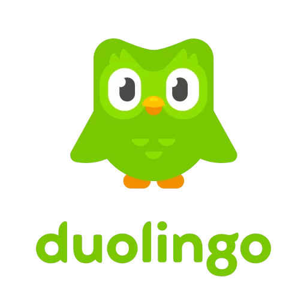

## This is where I learn Spanish
**Duolingo**
- This is Duolingo's website : 
[Doulingo.com](https://www.duolingo.com/)
- Also you can download it for android from :
[Duo.android](https://play.google.com/store/apps/details?id=com.duolingo&hl=en&gl=US)
- And if you are a IOS user :
[Duo.IOS](https://apps.apple.com/us/app/duolingo-language-lessons/id570060128)

## Biography in Spanish:
- hola, buenos días, mi nombre es Hosein y yo soy un niño, tengo dieciocho años y vivo en Iran. yo soy un studiante en la universidad y quiero ser ingeniero informático y estoy muy feliz de estar aqui. 

---
**Test**: This is atest
