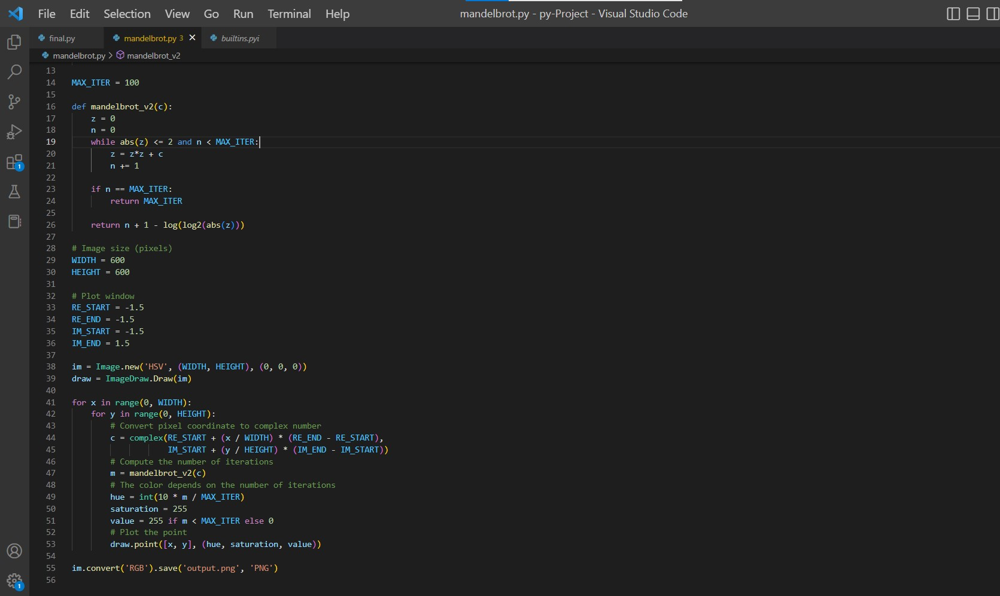
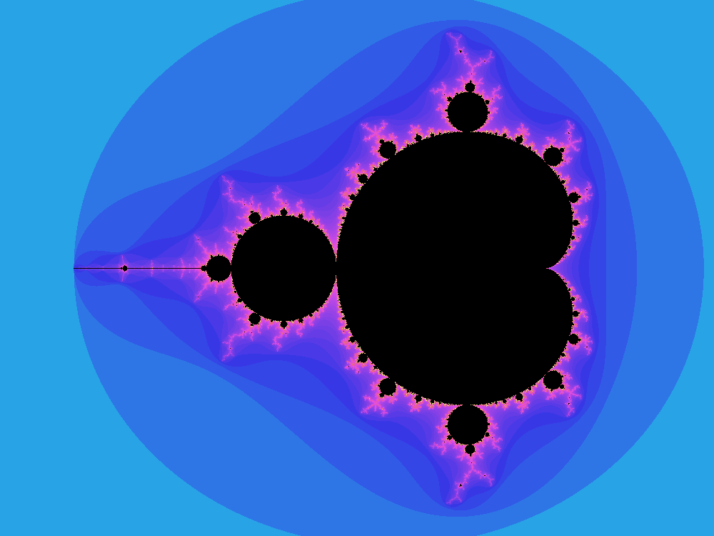
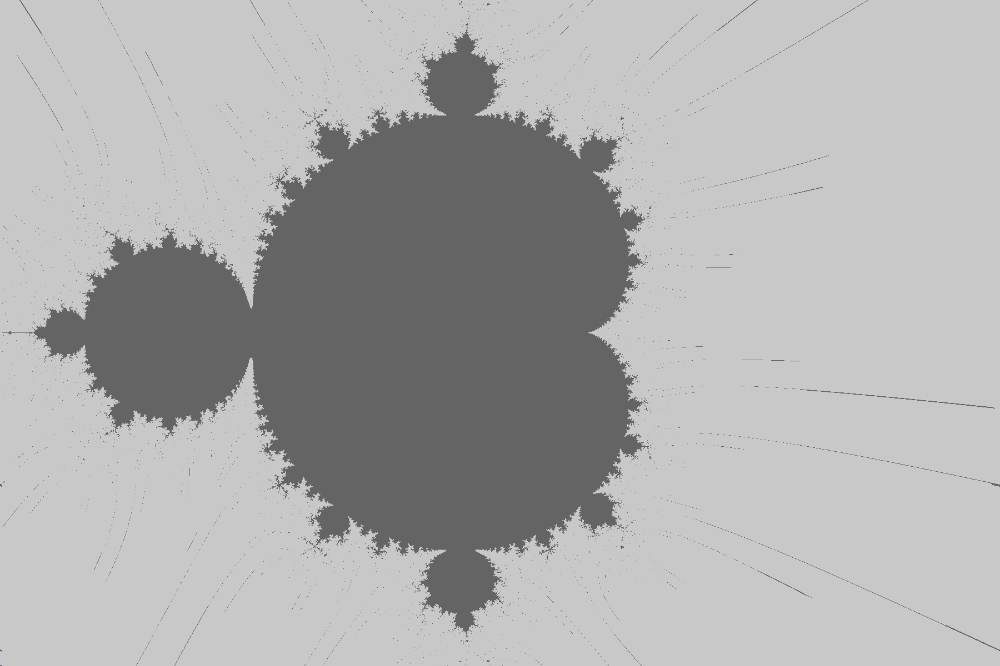

## what is mandelbrot set :
- The Mandelbrot set is the set of complex numbers.
**What did I do?**
## This is what I have done :
- At first, I was baffled about what is this project and what kind of purpose was behind that, but when I started to get along whit it, I got surprised that how interesting and vast it is. then I began to code and in the first place, I chose Python language because it has a lot of good and useable library that makes you more comfortable producing a picture.here are some of the python codes and mandelbrot set pics I have made:

- and the resault:

- So when I found out, what should I do in general, I went to C coding. It was very difficult and much more confusing and incomprehensible than Python, anyway ... I tried and tried, hours of coding and searching, lots of bugs, exhaustion, and being hopeless but I didn't give up, I made my first pic in C, it was in black and withe but that was okay because I knew I can make it colorful and more beautiful.

- the first attempt in C: an 1800 * 1200 pic :

- after that, I searched about HSV and RGB colors and found out what are they . so I made a function to convert HSV to RGB and yes it was a complete picture. after that, it was only a matter of how convert pictures to a video.

-[alt text](../assets/images/Asli.jpg "final C pic")

- In the end, I just downloaded the Sonic-Pi app (it is an app for making kinds of music and beats with code and programming, the link for download is below) I made a piece of music and arrange it whit my video and there it is you have done your project.

[sonic pi download](https://sonic-pi.net/)
---
